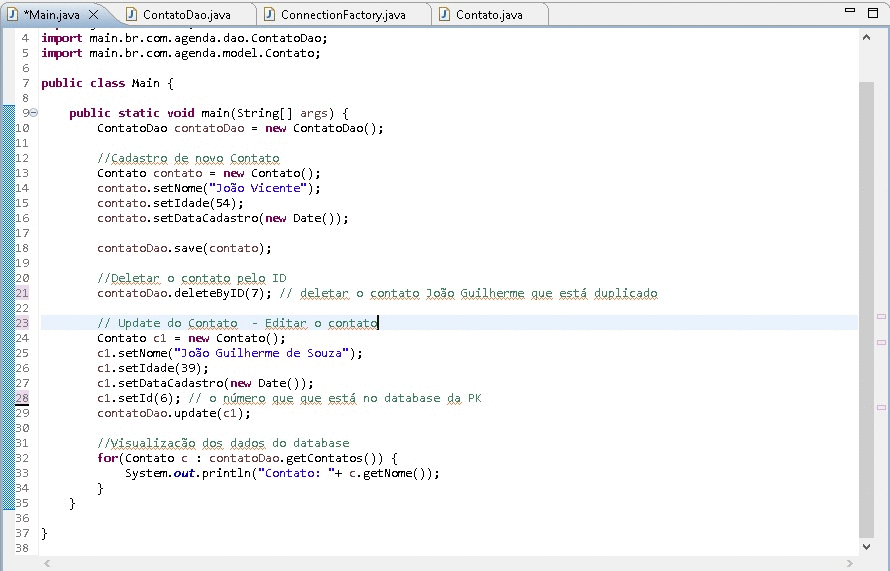

# Crud-Java-MySQL-JDBC

        

# Crud Listar Contatos
 Esta aplicação tem o objetivo de reproduzir as funcionalidades de um CRUD(acrônimo para Create, Read, Update e Delete) para uma agenda de contatos com Java, MySQLJDBC.
 
 ## 💻 Sobre o projeto
 Esse projeto foi desenvolvido com o objetivo de desenvolver uma aplicação de uma agenda de contatos em Java com MySQL JDBC.
 
 ## 💻 Estrutura do Projeto
 O projeto da agenda de contatos está estruturado de forma que há uma pasta para a Model(Contatos), outra pasta para a Dao(Data Acess Object), outra pasta para a ConnectionFactory(acesso ao database) e por fim a pasta para a Aplicação (testes das funcionalidades do CRUD).
 
 ### 🚧 Recursos Necessários

* jdk 17;
* IDE Eclipse;
* Xampp Control Panel v3.3.0; 

## 🛠 Tecnologias Utilizadas

* Java;
* Banco de dados da sua preferência;
* Servidor Apache Tomcat;

## 🛠 Orientações Importantes

### IDE e Servidor
* Baixe o Java 17.
* Baixe o Eclipse IDE 2023-03..
* Baixe o SQL (Você pode baixar o MySQL Workbench, ou qualquer outro serviço SQL).
* Baixe o repositório da aplicação. 

### Configuração e instalação
* Java - Instalação e configuração das variáveis de ambiente;
* IDE - Instalação da versão do Eclipse IDE for Enterprise Java and Web Developers;
* SQL - Instalação e configuração da porta 3306 como padrão; Uma alternativa de fácil utilização é o Xampp Control v3.3.0;

### Uso da Aplicação
* Baixe e execute o Script SQL;
* Abra o Xampp e clique em "Start em Apache e Mysql;
* No projeto  - "Run on Server";

## 🚀 Let's code! 
